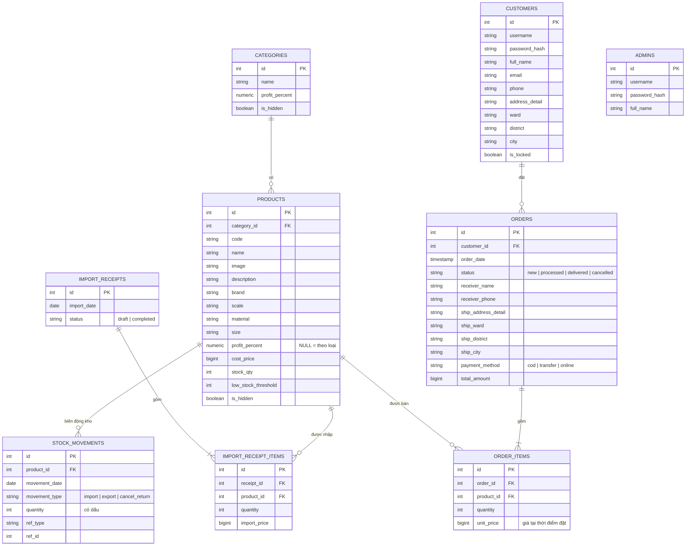

# Website bán mô hình

**Sản phẩm bán:** Mô hình (Gundam, OnePiece, DragonBall, Lego, ....)
**Công nghệ:** Frontend HTML/CSS/JS thuần 

## Phân tích nghiệp vụ

### Tác nhân

- **Admin / chủ cửa hàng:** đăng nhập riêng, quản trị toàn bộ.
- **Khách vãng lai:** chỉ xem và tìm kiếm sản phẩm.
- **Khách hàng đã đăng nhập:** dùng giỏ hàng, đặt hàng, xem lại đơn, sửa thông tin cá nhân.

### Quy tắc nghiệp vụ (chốt trước khi code, nói rõ khi báo cáo)

| Chủ đề | Quy tắc |
|---|---|
| **Phiếu nhập** | 2 trạng thái: *Nháp* và *Đã hoàn thành*. Chỉ sửa / xóa khi còn Nháp. Bấm "Hoàn thành" mới cộng tồn và cập nhật giá vốn. Không có nhà cung cấp (đúng đề). |
| **Giá vốn** | Bình quân gia quyền: `giá vốn mới = (tồn cũ × giá vốn cũ + SL nhập × giá nhập) / (tồn cũ + SL nhập)` |
| **Giá bán** | `giá bán = giá vốn × (1 + %LN / 100)`, làm tròn đến nghìn |
| **% Lợi nhuận** | Đặt theo loại (mặc định cho mọi SP trong loại) và có thể đặt riêng theo sản phẩm. **Ưu tiên: %LN của sản phẩm > %LN của loại.** |
| **Đơn hàng** | *Mới đặt → Đã xử lý → Đã giao*, hoặc *Hủy*. Trừ tồn khi chuyển sang **Đã xử lý**. Hủy đơn đã xử lý thì hoàn tồn. Đơn đã giao / đã hủy không đổi ngược. |
| **Đặt hàng** | Kiểm tra tồn khi đặt (không cho đặt quá số lượng còn); chốt **giá bán tại thời điểm đặt** vào chi tiết đơn, giá đổi sau này không làm sai đơn cũ. |
| **Tồn kho** | Không chỉ lưu một con số, mà lưu **sổ biến động kho** (mỗi lần nhập / xuất là một dòng). Nhờ đó tra được tồn tại một thời điểm và làm báo cáo nhập - xuất - tồn. |
| **Cảnh báo sắp hết** | Mỗi SP có `ngưỡng cảnh báo` (mặc định 5); tồn ≤ ngưỡng thì hiện cảnh báo trên dashboard. |
| **Xóa / Ẩn** | SP / loại đã phát sinh nhập hoặc bán thì **chỉ ẩn**; chưa phát sinh thì xóa hẳn. SP thuộc loại đã ẩn cũng không hiển thị cho khách. |
| **Khóa tài khoản** | Tài khoản bị khóa không đăng nhập được. Reset mật khẩu về mật khẩu mặc định (`123456`). |
| **Giỏ hàng** | Bắt buộc đăng nhập. Chưa đăng nhập bấm "Mua" thì chuyển sang trang đăng nhập. Giỏ lưu phía trình duyệt theo từng khách; tồn và giá được kiểm tra lại khi đặt hàng. |
| **Thanh toán** | Mặc định **Tiền mặt khi nhận hàng**; ngoài ra Chuyển khoản, Thanh toán trực tuyến (có thể giả lập thanh toán VNPay nếu có thời gian). |
| **Địa chỉ giao hàng** | Chọn địa chỉ trong tài khoản (chỉ đọc) **hoặc** nhập địa chỉ mới (form đủ trường: người nhận, SĐT, số nhà - đường, phường, quận, tỉnh / thành). |

### Yêu cầu chức năng theo đề

**Admin (5.0 điểm)**

1. Giao diện admin: trang đăng nhập riêng, danh mục chức năng quản trị (0.5)
2. Quản lý người dùng: danh sách, reset mật khẩu, khóa / mở khóa (0.75)
3. Quản lý loại sản phẩm: thêm, sửa, xóa / ẩn (0.25)
4. Quản lý sản phẩm: thêm (loại, mã, tên, hình, mô tả), sửa hiển thị đúng thông tin cũ, xóa / ẩn (0.75)
5. Quản lý nhập hàng: hiển thị và tìm phiếu, thêm phiếu (ngày nhập, giá nhập, số lượng), sửa và hoàn thành phiếu (0.75)
6. Quản lý giá bán: nhập / sửa %LN theo loại và theo sản phẩm; tra cứu giá vốn, %LN, giá bán (0.5)
7. Quản lý đơn hàng: tra cứu theo khoảng ngày và tình trạng; xem chi tiết và cập nhật tình trạng (0.5)
8. Quản lý tồn: tra tồn tại một thời điểm, cảnh báo sắp hết, nhập - xuất - tồn theo khoảng thời gian (0.75)

**Khách hàng (5.0 điểm)**

1. Đăng ký, đăng nhập / đăng xuất (hiện tài khoản đang đăng nhập), xem / sửa thông tin cá nhân (0.5)
2. Hiển thị sản phẩm theo loại có phân trang, chi tiết sản phẩm, tìm cơ bản (theo tên) và tìm nâng cao (tên + loại + khoảng giá), kết quả có phân trang (2.0)
3. Giỏ hàng: mua từ trang loại và trang chi tiết, thêm bớt, chọn địa chỉ, chọn thanh toán, xem lại đơn khi kết thúc (2.25)
4. Xem lại đơn hàng đã mua (0.25)

**Điểm cộng (2.0):** dùng công cụ đồ họa thiết kế layout (1.0), triển khai trên Internet (1.0), chia đều cho các thành viên.

---

## Thiết kế cơ sở dữ liệu

### ERD



### Mô tả các bảng

| Bảng | Vai trò | Ghi chú |
|---|---|---|
| `admins` | Tài khoản quản trị | Tách riêng với khách nên đăng nhập riêng |
| `customers` | Tài khoản khách | `is_locked` để khóa; địa chỉ tách 4 trường |
| `categories` | Loại sản phẩm | `profit_percent` là %LN mặc định của loại; `is_hidden` để ẩn |
| `products` | Sản phẩm | `profit_percent` NULL nghĩa là dùng của loại; `cost_price`, `stock_qty` là cột tính sẵn |
| `import_receipts` | Phiếu nhập | `status` = `draft` / `completed` |
| `import_receipt_items` | Chi tiết phiếu nhập | Số lượng và giá nhập từng SP |
| `stock_movements` | Sổ biến động kho | `quantity` có dấu (+ vào, − ra); nguồn sự thật của tồn kho |
| `orders` | Đơn hàng | Lưu bản sao địa chỉ giao để đổi địa chỉ tài khoản không ảnh hưởng đơn cũ |
| `order_items` | Chi tiết đơn | `unit_price` chốt tại thời điểm đặt |

### Công thức

- **Giá bán hiệu lực** = `giá vốn × (1 + COALESCE(products.profit_percent, categories.profit_percent) / 100)`, làm tròn đến nghìn.
- **Tồn tại ngày D** = tổng `quantity` trong `stock_movements` với `movement_date ≤ D`.
- **Nhập - xuất - tồn từ A đến B:** tồn đầu (trước A) + nhập (A..B) − xuất ròng (A..B) = tồn cuối. Xuất ròng = xuất − hàng hoàn do hủy đơn.

### Dữ liệu mẫu đã chuẩn bị

- 1 admin (`admin` / `admin123`), 4 khách (mật khẩu `123456`, trong đó `phamthid` đang bị khóa).
- 6 loại (1 loại đã ẩn), **30 sản phẩm**, mỗi loại 6 SP (đặt kích thước trang 4 để thấy phân trang).
- 4 phiếu nhập (3 đã hoàn thành, 1 nháp để demo sửa và hoàn thành).
- 6 đơn hàng đủ 4 trạng thái (mới đặt, đã xử lý, đã giao, hủy), một đơn giao tới địa chỉ khác địa chỉ tài khoản.
- 4 sản phẩm sắp hết hàng (GD006, FG003, XE003, KT006) để demo cảnh báo.
- 3 sản phẩm có %LN riêng (GD003 = 35%, FG002 = 40%, XE003 = 25%) để demo ưu tiên %LN của SP so với của loại.

## Cấu trúc thư mục

```
model-shop/ (Dự án gốc)
├── .gitignore                    --> node_modules/, dist/, .env (KHÔNG commit .env)
├── README.md
│
├── frontend/                    
│   ├── index.html                --> Trang chủ
│   ├── pages/                    --> Các trang dành cho khách hàng
│   │   ├── login.html, register.html, profile.html
│   │   ├── category.html, product.html, search.html
│   │   └── cart.html, checkout.html, order-review.html, my-orders.html
│   ├── admin/                    --> Các trang quản trị
│   │   ├── login.html            --> Đăng nhập Admin riêng biệt
│   │   ├── index.html            --> Dashboard + Menu + Cảnh báo tồn
│   │   ├── customers.html, categories.html, products.html, product-form.html
│   │   ├── imports.html, import-form.html
│   │   └── pricing.html, orders.html, order-detail.html, inventory.html
│   ├── js/
│   │   ├── data.js               --> Cấu trúc CSDL (DB_SCHEMA) + dữ liệu mẫu (DB_SEED), KHÔNG có logic
│   │   ├── common.js             --> Service/API: tự chọn chế độ Local hoặc gọi API backend
│   │   ├── layout.js             --> (tùy chọn) dựng header/footer/menu admin dùng chung
│   │   ├── pages/                --> (tùy chọn) script riêng từng trang khách: category.js, cart.js...
│   │   └── admin/                --> (tùy chọn) script riêng từng trang admin: orders.js, imports.js...
│   ├── css/
│   │   ├── style.css             --> Style phần khách hàng
│   │   └── admin.css             --> Style phần quản trị
│   └── assets/
│       ├── fonts/                --> Font tiếng Việt local (@font-face, không dùng CDN)
│       ├── img/products/         --> Ảnh sản phẩm local (mã_SP.jpg, ví dụ GD001.jpg)
│       └── vendor/               --> (tùy chọn) Bootstrap, icon... tải về local
│
└── backend/                      --> NestJS + Prisma ORM + PostgreSQL (Deploy Render, Root Directory = backend)
    ├── prisma/
    │   ├── schema.prisma         --> Sơ đồ Entities/Tables
    │   └── seed.ts               --> Nạp dữ liệu ban đầu (đọc ../../frontend/js/data.js)
    ├── database/
    │   └── schema.sql            --> SQL thuần của cùng cấu trúc, chỉ để xem / chạy thử trong psql
    ├── src/
    │   ├── modules/
    │   │   ├── auth/             --> Đăng ký, đăng nhập khách, đăng nhập admin, JWT
    │   │   ├── users/            --> Hồ sơ cá nhân (khách) + quản lý khách (admin)
    │   │   ├── categories/, products/
    │   │   ├── imports/          --> Phiếu nhập, hoàn thành phiếu
    │   │   ├── pricing/          --> %LN, giá vốn, giá bán
    │   │   ├── orders/           --> Đặt hàng (khách) + quản lý đơn (admin)
    │   │   ├── inventory/        --> Tồn tại thời điểm, cảnh báo, nhập - xuất - tồn
    │   │   └── health/           --> GET /api/health
    │   ├── common/               --> JwtAuthGuard, RolesGuard, @Roles(), filter lỗi
    │   ├── prisma/               --> PrismaService (dùng chung)
    │   ├── app.module.ts
    │   └── main.ts
    ├── .env.example              --> DATABASE_URL, JWT_SECRET, CORS_ORIGIN, PORT
    ├── package.json
    └── nest-cli.json
```

## Bản đồ trang HTML và điểm

### Admin (5.0)

| Trang | Nội dung | Điểm |
|---|---|---|
| `admin/login.html` | Đăng nhập riêng, không chung khách | 0.5 (cùng menu) |
| `admin/index.html` | Layout, menu quản trị, dashboard, cảnh báo hết hàng | |
| `admin/customers.html` | Danh sách, reset mật khẩu, khóa / mở khóa | 0.75 |
| `admin/categories.html` | Thêm / sửa / xóa-ẩn loại | 0.25 |
| `admin/products.html` + `product-form.html` | Thêm (loại, mã, tên, hình, mô tả), sửa hiển thị đúng dữ liệu cũ, xóa / ẩn | 0.75 |
| `admin/imports.html` + `import-form.html` | Danh sách và tìm phiếu, thêm, sửa, hoàn thành | 0.75 |
| `admin/pricing.html` | Nhập / sửa %LN theo loại và theo SP; tra cứu giá vốn, %LN, giá bán | 0.5 |
| `admin/orders.html` + `order-detail.html` | Lọc theo khoảng ngày và tình trạng; chi tiết, cập nhật trạng thái | 0.5 |
| `admin/inventory.html` | Tồn theo SP / loại tại thời điểm, cảnh báo sắp hết, nhập - xuất - tồn theo khoảng thời gian | 0.75 |

### Khách hàng (5.0)

| Trang | Nội dung |
|---|---|
| `index.html` | Trang chủ, thanh tìm kiếm cơ bản |
| `pages/register.html`, `pages/login.html`, `pages/profile.html` | Đăng ký, đăng nhập / đăng xuất (hiện tên tài khoản), xem / sửa thông tin cá nhân |
| `pages/category.html?id=` | Danh sách theo loại **có phân trang** |
| `pages/product.html?id=` | Chi tiết (tỉ lệ, hãng, chất liệu, kích thước...), nút thêm giỏ |
| `pages/search.html` | Tìm cơ bản theo tên; **tìm nâng cao: tên + loại + khoảng giá kết hợp**, kết quả **có phân trang** |
| `pages/cart.html` | Thêm / bớt số lượng, xóa dòng |
| `pages/checkout.html` | Chọn địa chỉ từ tài khoản **hoặc** nhập địa chỉ mới; chọn thanh toán (mặc định tiền mặt) |
| `pages/order-review.html` | Xem lại đơn khi kết thúc |
| `pages/my-orders.html` | Lịch sử đơn hàng đã mua |

---
